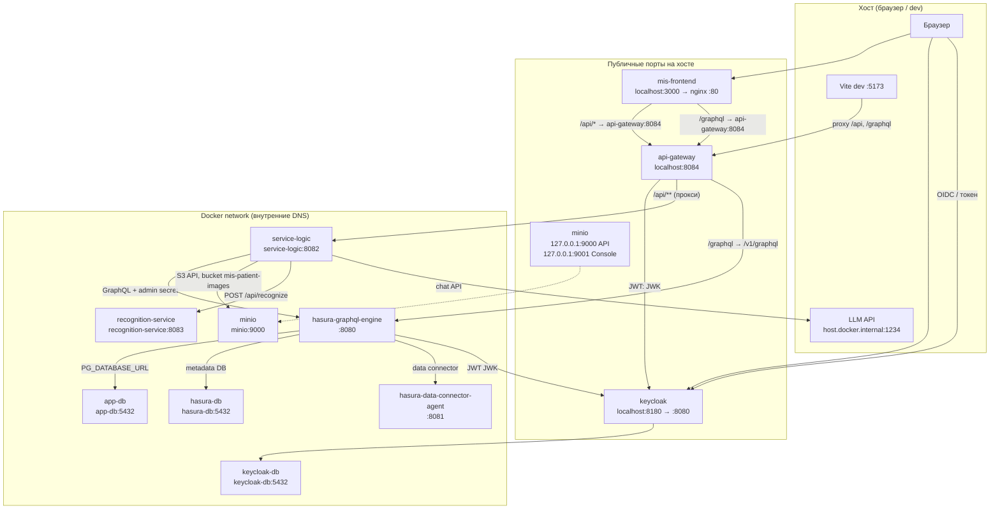
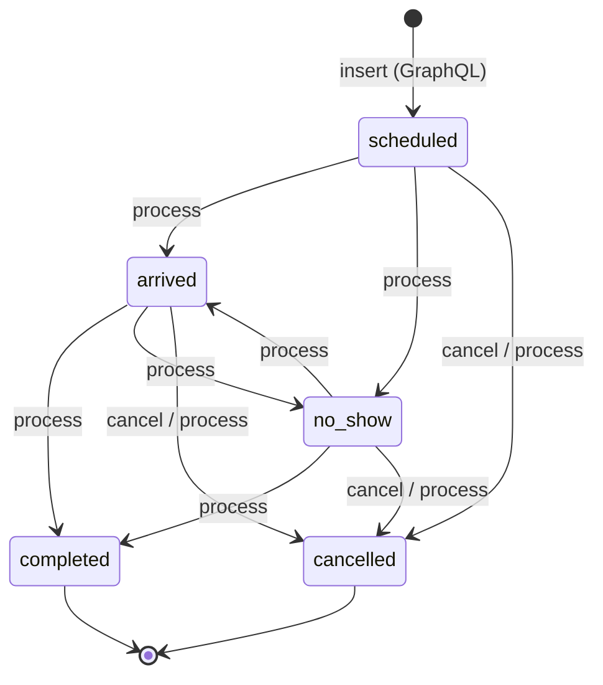
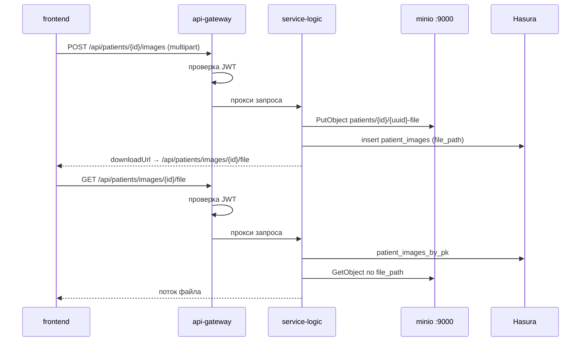

# Архитектура MIS

Стек описан в корневом [`docker-compose.yml`](../docker-compose.yml). Ниже — сервисы, связи, порты и маршруты.

**Сценарии по ролям и вкладкам UI:** [use-cases.md](use-cases.md).

## Общая схема (Docker Compose)



## Кто к кому обращается

| От | К | Путь / назначение |
|----|---|-------------------|
| **Браузер** | **mis-frontend** `:3000` | UI (React) |
| **Браузер** | **Keycloak** `:8180` | Вход OIDC, получение JWT (`mis-frontend`, realm `mis`) |
| **mis-frontend** (nginx) | **api-gateway** `api-gateway:8084` | `/api/*`, `/graphql` |
| **mis-frontend** | **Hasura** (через gateway) | GraphQL **subscriptions** (WebSocket upgrade на `/graphql`) |
| **Vite dev** `:5173` | **api-gateway** `localhost:8084` | те же прокси |
| **api-gateway** | **Keycloak** `keycloak:8080` | проверка JWT (JWK) |
| **api-gateway** | **service-logic** `service-logic:8082` | REST `/api/**` (прокси) |
| **api-gateway** | **Hasura** `hasura-graphql-engine:8080` | GraphQL `/graphql` → `/v1/graphql` |
| **service-logic** | **Hasura** `hasura-graphql-engine:8080` | мутации/запросы с `x-hasura-admin-secret` |
| **service-logic** | **recognition-service** `recognition-service:8083` | `POST /api/recognize` |
| **service-logic** | **MinIO** `minio:9000` | S3: `PutObject` / `GetObject`, бакет `mis-patient-images` |
| **service-logic** | **LLM** (вне Docker) | `host.docker.internal:1234/api/v1/chat` |
| **Админ (хост)** | **MinIO Console** `127.0.0.1:9001` | веб-консоль объектов (не используется UI) |
| **Hasura** | **app-db** `app-db:5432` | данные MIS (`app-mis`) |
| **Hasura** | **hasura-db** `hasura-db:5432` | метаданные Hasura |
| **Hasura** | **hasura-data-connector-agent** `:8081` | data connector |
| **Hasura** | **Keycloak** `keycloak:8080` | JWT RS256 (JWK) |
| **Keycloak** | **keycloak-db** `keycloak-db:5432` | БД realm |

## Порты и адреса

### С хоста (доступ с машины разработчика)

| Сервис | URL / адрес | Примечание |
|--------|-------------|------------|
| **mis-frontend** | http://localhost:3000 | UI в Docker |
| **Vite (локально)** | http://localhost:5173 | `npm run dev`, прокси на gateway |
| **api-gateway** | http://localhost:8084 | единая точка API и GraphQL (`/graphql`) |
| **Keycloak** | http://localhost:8180 | Admin + OIDC (`/realms/mis`) |
| **app-db** | 127.0.0.1:5435 | PostgreSQL (Liquibase) |
| **hasura-db** | 127.0.0.1:5434 | метаданные Hasura |
| **keycloak-db** | 127.0.0.1:5433 | БД Keycloak |
| **MinIO S3 API** | http://127.0.0.1:9000 | только localhost; для отладки / `mc` |
| **MinIO Console** | http://127.0.0.1:9001 | веб-UI (`MINIO_ROOT_USER` / `MINIO_ROOT_PASSWORD`) |
| **LLM** | http://host.docker.internal:1234 | вне compose, из `.env` |

### Внутри Docker (межсервисные)

| Сервис | DNS | Порт |
|--------|-----|------|
| api-gateway | `api-gateway` | 8084 |
| service-logic | `service-logic` | 8082 (не проброшен наружу) |
| recognition-service | `recognition-service` | 8083 (только `expose`) |
| hasura-graphql-engine | `hasura-graphql-engine` | 8080 |
| hasura-data-connector-agent | `hasura-data-connector-agent` | 8081 |
| keycloak | `keycloak` | 8080 |
| app-db | `app-db` | 5432 |
| hasura-db | `hasura-db` | 5432 |
| keycloak-db | `keycloak-db` | 5432 |
| minio | `minio` | 9000 (S3 API), 9001 (console, только с хоста) |

## GraphQL и REST

| Данные / действие | Канал | Кто вызывает |
|-------------------|-------|--------------|
| Пациенты: список, карточки | GraphQL query / **subscription** | frontend → gateway → Hasura (JWT + `x-hasura-role`) |
| Пациенты: создание | GraphQL mutation | frontend |
| Пациенты: `attendance_probability` | REST `PUT /api/patients/{id}/attendance-probability` | frontend → service-logic → Hasura (admin) |
| Пациенты: саммари истории | REST `POST /api/patients/{id}/summaries` | frontend → service-logic → Hasura |
| Приёмы: список | GraphQL **subscription** | frontend |
| Приёмы: создание (`scheduled`) | GraphQL mutation | frontend; `status` фиксируется Hasura |
| Приёмы: смена статуса, жалобы, лечение | REST `PUT /api/appointments/{id}/process` | frontend → service-logic (FSM + optimistic lock) |
| Приёмы: отмена | REST `POST /api/appointments/{id}/cancel` | frontend → service-logic |
| Снимки: метаданные в БД | Hasura `patient_images` (без `file_path` у `user`) | service-logic (admin) при upload |
| Снимки: байты | REST upload / download | frontend → service-logic → MinIO |
| Шаблоны документов, referral-справочники | GraphQL query | frontend; фильтр `document_type` по роли |
| Печать документа | — | только клиент (HTML + print) |
| LLM (саммари, явка) | REST `/api/llm/*` | frontend → service-logic → LLM |
| Распознавание | REST `/api/recognition/*` | frontend → service-logic → recognition-service |

**Subscriptions:** клиент открывает WebSocket на `/graphql` (через gateway). JWT передаётся в `connectionParams`; на gateway для GET upgrade проверка JWT не выполняется — валидация в Hasura.

## Жизненный цикл приёма (автомат состояний, FSM)

**FSM** (finite state machine, **конечный автомат** / **автомат состояний**) — модель: у приёма есть фиксированный набор **статусов** и **разрешённых переходов** между ними. Нельзя перейти из «запланирован» сразу в «завершён», минуя допустимые шаги. В коде это класс [`AppointmentStatusTransitions`](../backend/service-logic/src/main/java/com/mis/servicelogic/service/AppointmentStatusTransitions.java); на фронте те же правила подсказывают выбор статуса в форме приёма.



Конкурентное обновление: мутация Hasura с условием `status = expected` → при рассинхроне **409 Conflict**.

## Фоновые процессы

| Процесс | Сервис | Когда | Настройка |
|---------|--------|-------|-----------|
| **Attendance backfill** | service-logic | после `ApplicationReady` (async) | `ATTENDANCE_BACKFILL_*` в `.env` |
| Создание бакета MinIO | service-logic | при старте | `MINIO_BUCKET` |
| Миграции Liquibase | app-db | при старте контейнера | `backend/liquibase/` |

Backfill: для пациентов без `attendance_probability` читает историю приёмов из Hasura, вызывает LLM, пишет процент через admin API.

## Переменные окружения (ключевые)

| Переменная | Назначение |
|------------|------------|
| `HASURA_ADMIN_SECRET` | admin API для service-logic |
| `HASURA_GRAPHQL_JWT_SECRET` | JWT Hasura (issuer localhost, JWK внутри Docker) |
| `HASURA_GRAPHQL_DEV_MODE` | console и dev-фичи Hasura |
| `KEYCLOAK_ISSUER_URI` / `KEYCLOAK_JWK_SET_URI` | проверка JWT на gateway |
| `KEYCLOAK_CLIENT_ID` | `azp` = `mis-frontend` |
| `CORS_ALLOWED_ORIGIN_PATTERNS` | origin UI |
| `LLM_API_URL`, `LLM_MODEL`, `LLM_*_PROMPT` | внешний LLM |
| `ATTENDANCE_BACKFILL_*` | фоновый пересчёт явки |
| `MINIO_*` | объектное хранилище снимков |
| `EXPLAIN_ON_INFERENCE`, `LIME_*`, `SHAP_*` | recognition-service |

Полный список: [`.env.example`](../.env.example).

## MinIO — хранение снимков пациентов

**MinIO** — S3-совместимое объектное хранилище. Снимки не попадают в PostgreSQL: в `app-db` через Hasura хранятся только метаданные (`patient_images.file_path` — ключ объекта).

| Параметр | Значение по умолчанию |
|----------|----------------------|
| Бакет | `mis-patient-images` |
| Endpoint (Docker) | `http://minio:9000` |
| Endpoint (хост) | `http://127.0.0.1:9000` |
| Учётные данные | `MINIO_ROOT_USER` / `MINIO_ROOT_PASSWORD` из `.env` |

Доступ из приложения — **только через service-logic** (AWS SDK S3). Клиент не получает `file_path` из GraphQL; загрузка и скачивание — через REST с JWT.



При старте **service-logic** создаёт бакет, если его нет (`MinioBucketInitializer`).

## Маршруты API Gateway

Конфигурация: [`backend/api-gateway/src/main/resources/application.yml`](../backend/api-gateway/src/main/resources/application.yml).

| Предикат | Проксируется на | Примечание |
|----------|-----------------|------------|
| `/api/**` | `SERVICE_LOGIC_URL` (по умолчанию `http://service-logic:8082`) | REST |
| `/graphql`, `/graphql/**` | `HASURA_URL` (по умолчанию `http://hasura-graphql-engine:8080`) | rewrite → `/v1/graphql` |

## REST в service-logic (через `/api/**`)

| Префикс | Назначение |
|---------|------------|
| `/api/recognition/*` | запуск распознавания снимков |
| `/api/llm/summarize` | саммари визита (LLM) |
| `/api/llm/attendance-probability` | прогноз явки (LLM) |
| `/api/patients/{id}/attendance-probability` | сохранение в БД через Hasura |
| `/api/patients/{id}/summaries` | сохранение саммари |
| `POST /api/patients/{id}/images` | загрузка снимка → MinIO + запись в Hasura |
| `GET /api/patients/images/{imageId}/file` | скачивание снимка из MinIO |
| `PUT /api/appointments/{id}/process` | обработка приёма (статус, жалобы, заметки) |
| `POST /api/appointments/{id}/cancel` | отмена приёма (FSM) |

## Поток аутентификации

```mermaid
sequenceDiagram
  participant B as Браузер
  participant FE as frontend :3000
  participant KC as Keycloak :8180
  participant GW as api-gateway :8084
  participant SL as service-logic :8082
  participant H as Hasura :8080

  B->>KC: OIDC login (PKCE)
  KC-->>B: JWT access token
  B->>FE: UI + Bearer token
  FE->>GW: /api/* или /graphql + Authorization
  GW->>KC: проверка JWT (JWK, azp)
  alt REST
    GW->>SL: прокси /api/**
    SL->>H: GraphQL (admin secret)
  else GraphQL POST
    GW->>H: /v1/graphql (JWT → x-hasura-*)
  else GraphQL GET (WebSocket upgrade)
    Note over GW,H: GET /graphql без JWT на gateway;<br/>токен в connectionParams, проверка в Hasura
    GW->>H: /v1/graphql
  end
```

## Граница доверия (service-logic)

**service-logic** доступен только внутри Docker-сети (`expose: 8082`, порт не проброшен наружу). JWT проверяется **только на api-gateway**; внутренние сервисы доверяют сети compose и не повторяют проверку токена.

**Модель данных:** одна клиника — все авторизованные сотрудники видят общий реестр. Row-level isolation не реализована.

**Роли Keycloak / Hasura:**

| Роль | Назначение | UI | GraphQL | REST (через gateway) |
|------|------------|-----|---------|------------------------|
| `user` (врач) | лечение | вкладка «Приём», направления | referral, не receipt | любой авторизованный пользователь |
| `registrar` (регистратура) | запись и оплата | без «Приём» | только receipt (чек) | любой авторизованный пользователь |

Ограничения по ролям на уровне данных и UI — в Hasura и frontend. REST service-logic не различает роли: gateway пропускает только запросы с валидным JWT.

Клиент передаёт заголовок `x-hasura-role` по MIS-роли из JWT (`realm_access.roles`).

| Риск | Митигация |
|------|-----------|
| Прямой вызов `http://service-logic:8082` из Docker-сети | Порт не опубликован на хост; доступ только из compose |
| Обход FSM статусов через GraphQL | У роли `user` нет `update` на `appointments`; обработка/отмена — только REST |
| Конкурентное сохранение приёма | Optimistic lock по текущему `status` → 409 Conflict |
| Утечка `file_path` снимков через GraphQL | Поле скрыто от роли `user`; скачивание — только REST через gateway |
| Дефолтные секреты в production | `HASURA_ADMIN_SECRET` обязателен в `.env` (compose fail-fast) |
| Прямой вызов Hasura GraphQL с хоста | Порт 8080 не проброшен; клиенты — только `http://localhost:8084/graphql` |
| Hasura Console / metadata CLI | Только из Docker-сети; `HASURA_GRAPHQL_DEV_MODE=false` в production |

## Важные замечания

- **recognition-service**, **service-logic** и **hasura-graphql-engine** с хоста напрямую не открыты — только через **api-gateway** (`/api/**`, `/graphql`).
- **MinIO** проброшен на `127.0.0.1:9000` / `:9001` (не `0.0.0.0`) — для админки и отладки; UI работает через REST, не через presigned URL.
- GraphQL и subscriptions: frontend → nginx/Vite → gateway `:8084/graphql` → Hasura `/v1/graphql`.
- JWT issuer для браузера: `http://localhost:8180/realms/mis`; внутри Docker JWK: `http://keycloak:8080/realms/mis/protocol/openid-connect/certs`.
- Миграции схемы приложения: Liquibase в контейнере **app-db** ([`backend/liquibase/`](../backend/liquibase/)).

## Краткое описание сервисов

| Сервис | Технология | Роль |
|--------|------------|------|
| **mis-frontend** | React, Vite, nginx | UI, OIDC (Keycloak), прокси `/api` и `/graphql` на gateway |
| **api-gateway** | Spring Cloud Gateway | JWT (`azp`, issuer), CORS, маршрутизация |
| **service-logic** | Spring Boot | Оркестрация в доверенной сети: LLM, распознавание, MinIO, Hasura (admin) |
| **minio** | MinIO | S3-хранилище снимков (`mis-patient-images`) |
| **recognition-service** | FastAPI, DentalNet | Инференс по снимкам |
| **hasura-graphql-engine** | Hasura v2.48 | GraphQL к `app-db`; с хоста только через gateway |
| **app-db** | PostgreSQL 18 + Liquibase | Данные MIS |
| **hasura-db** | PostgreSQL 18 | Метаданные Hasura |
| **keycloak** | Keycloak 24 | OIDC, realm `mis` |
| **keycloak-db** | PostgreSQL 18 | БД Keycloak |
