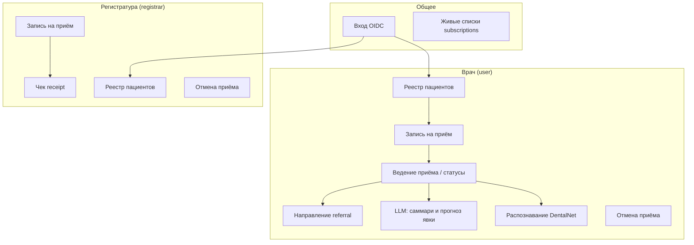
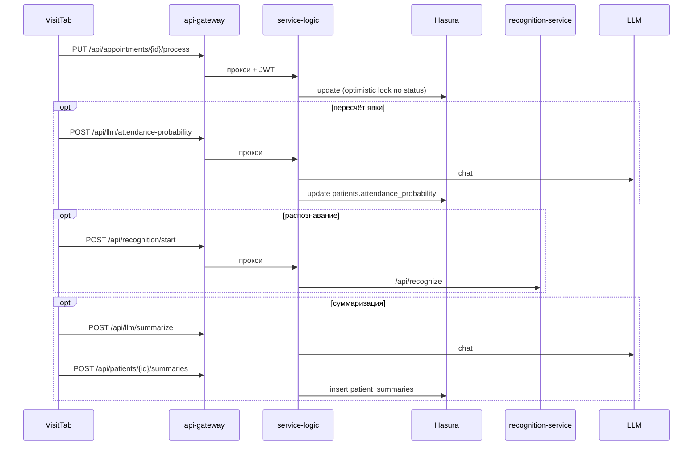
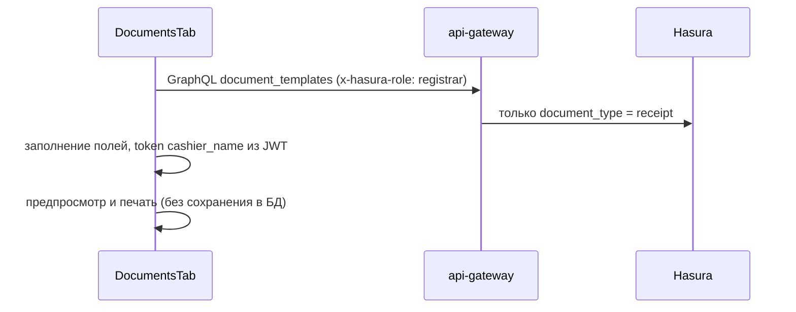

# Сценарии использования MIS

Дополнение к [architecture.md](architecture.md): роли, вкладки UI и каналы доступа к данным (GraphQL / REST).

## Акторы

| Актор | Keycloak-роль | Вкладки UI |
|-------|---------------|------------|
| **Врач** | `user` | Пациенты, Приёмы, **Приём**, Документы |
| **Регистратура** | `registrar` | Пациенты, Приёмы, Документы (без «Приём») |

Один аккаунт не должен иметь обе MIS-роли одновременно (`resolveMisRole` → ошибка входа).

Демо-пользователи после `scripts/keycloak-create-demo-user.sh`: `demo` (врач), `registrar` (регистратура).

## Обзор use case

## Вкладки и сценарии

| Вкладка | Врач | Регистратура | Основные действия |
|---------|:----:|:------------:|-------------------|
| **Пациенты** | ✓ | ✓ | список/карточки (subscription), создание пациента |
| **Приёмы** | ✓ | ✓ | список (subscription), создание приёма, отмена; врач — переход в «Приём» |
| **Приём** | ✓ | — | сохранение визита (автомат состояний), распознавание, суммаризация, пересчёт явки |
| **Документы** | ✓ | ✓ | шаблоны: referral (врач) / receipt (регистратура), печать |
| **Отчёты** | заглушка | заглушка | — |

## Сценарии по каналу доступа

| Сценарий | UI | Канал | Примечание |
|----------|-----|-------|------------|
| Список пациентов (live) | Пациенты | GraphQL **subscription** | разные поля для `user` / `registrar` |
| Создание пациента | Пациенты | GraphQL mutation | `insert_patients_one` |
| Список приёмов (live) | Приёмы | GraphQL **subscription** | у регистратора без `complaints` / `treatment_done` |
| Создание приёма | Приёмы | GraphQL mutation | статус `scheduled` задаётся Hasura |
| Отмена приёма | Приёмы | REST `POST …/cancel` | переход в `cancelled` по правилам |
| Обработка приёма (статус, жалобы, лечение) | Приём | REST `PUT …/process` | только UI врача; Hasura `update` на `appointments` закрыт |
| Распознавание снимка | Приём → Распознавание | REST `/api/recognition/start` | → recognition-service |
| Суммаризация визитов | Приём → Суммаризация | REST `/api/llm/summarize` + `…/summaries` | LLM вне compose |
| Прогноз явки пациента | Приёмы / Приём | REST LLM + `PUT …/attendance-probability` | также фоновый backfill при старте |
| Шаблоны документов | Документы | GraphQL query | фильтр `document_type` по роли в Hasura |
| Справочник направлений | Документы (referral) | GraphQL query | `referral_directions` / clinics / specialists |
| Печать документа | Документы | **Клиент** | рендер HTML из шаблона + `window.print`, БД не пишет |
| Загрузка/скачивание снимка | API готово | REST `/api/patients/…/images` | UI может быть не подключён |

Подробнее про порты и сервисы: [architecture.md](architecture.md).

## Врач: ведение приёма

Допустимые переходы статуса — раздел «Жизненный цикл приёма» в [architecture.md](architecture.md).

## Регистратура: документы (чек)

## Врач: направление (referral)

Аналогично чеку, но Hasura отдаёт шаблоны с `document_type != receipt` и подгружает справочники `referral_*` для полей направления.

## Ограничения по ролям

| Область | Где enforced |
|---------|----------------|
| Вкладка «Приём» | frontend (`doctorOnly`) |
| Шаблоны receipt / referral | Hasura `select_permissions` на `document_templates` |
| Поля приёма у регистратора | Hasura column permissions + отдельные subscription |
| Смена статуса приёма | REST + автомат состояний в service-logic; GraphQL `update` на `appointments` отсутствует |
| REST без разделения ролей | Любой клиент с JWT может вызвать `/process`; опора на UI и закрытую сеть |

## Связанные документы

- [architecture.md](architecture.md) — инфраструктура, жизненный цикл приёма, GraphQL vs REST, безопасность
- [../README.md](../README.md) — запуск стека
